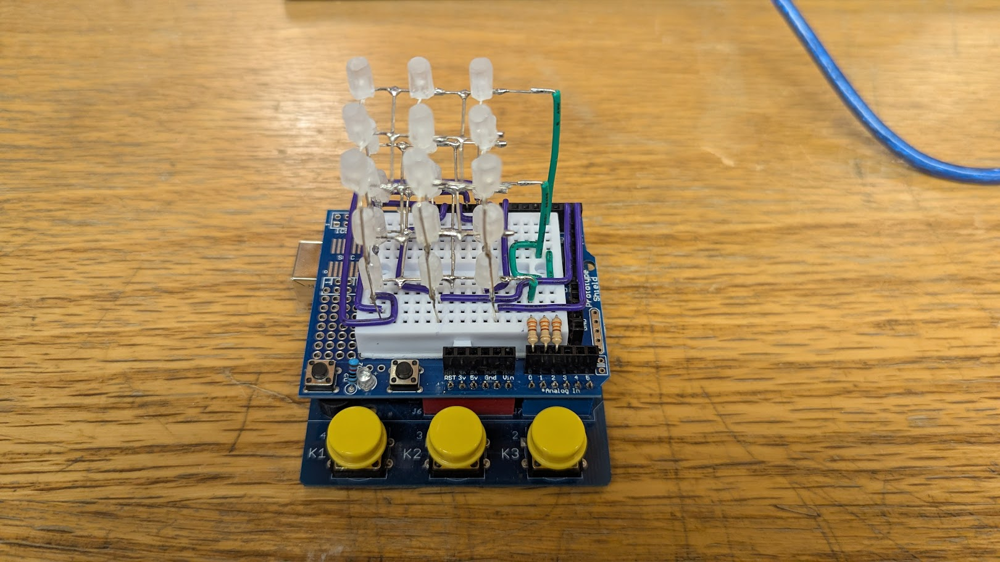

# 🔲 3×3×3 LED Cube (Custom Arduino Uno Board)

## 📌 Project Overview
This project is a **3×3×3 LED Cube** built on a breadboard and controlled using a **custom soldered Arduino Uno–compatible PCB**. The PCB, components, and chips were provided, and the board was fully assembled through manual soldering.

The cube consists of **27 LEDs** arranged in three vertical layers, forming a three-dimensional display capable of lighting individual LEDs or patterns through software control.

A **complete schematic diagram** for the circuit is included in this repository.

---

## 🧰 Hardware Used
- Custom soldered **Arduino Uno–compatible PCB**
- 27 LEDs arranged in a 3×3×3 configuration
- Breadboard
- 330 Ω resistors
- Jumper wires
- Push buttons (3)
- Buzzer
- USB cable for programming and power

---

## 🔧 Circuit Organization
The LED cube is organized into:

- **3 layers** (horizontal planes)  
  - Each layer shares a **common ground**
- **9 columns** (vertical lines)  
  - Each column shares a **common positive (power)**

This wiring structure allows individual LEDs to be controlled using a combination of one column and one layer.

---

## 💡 How the LED Cube Works
Each LED in the cube belongs to:
- **One layer (ground connection)**
- **One column (positive connection)**

To turn on a **specific LED**:
1. The Arduino sends **power (HIGH)** to the desired column’s pin  
2. The Arduino connects **ground (LOW)** to the desired layer’s pin  

Only the LED that lies at the intersection of that column and layer will turn on.

### Example
To light the LED located at:
- Column 5  
- Layer 2  

The Arduino:
- Sets **Column 5** to HIGH  
- Grounds **Layer 2**

All other LEDs remain off because they are missing either power or ground.

---

## 📐 Schematic Diagram
A full schematic diagram showing:
- LED column connections
- Layer ground connections
- Resistors
- Push buttons
- Buzzer
- Arduino pin mappings  

---

## 💻 Software
- Written in **Arduino (C/C++)**
- Controls which columns receive power and which layers are grounded
- Implements LED patterns and interactions
- Uploaded directly to the custom Arduino board via USB
---
## ▶️ How to Run
1. Open the `.ino` file in **Arduino IDE**
2. Select **Arduino Uno** as the board
3. Select the correct **COM/USB port**
4. Upload the code
5. Power the board and observe the LED cube behavior

---

## 🧠 Concepts Demonstrated
- Digital input/output control
- Layered circuit design
- Soldering and PCB assembly
- Breadboard prototyping
- Embedded programming with Arduino
- Interfacing buttons and a buzzer

---

